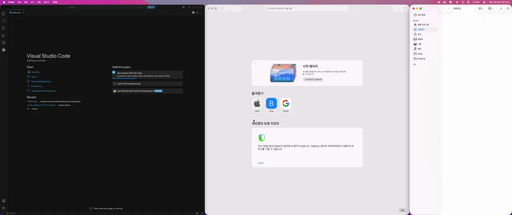
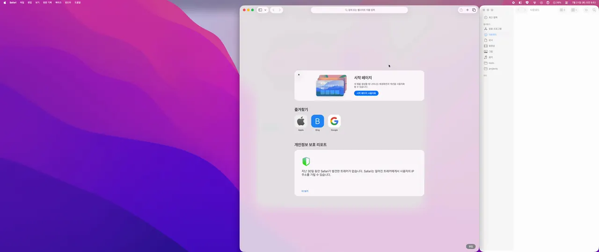
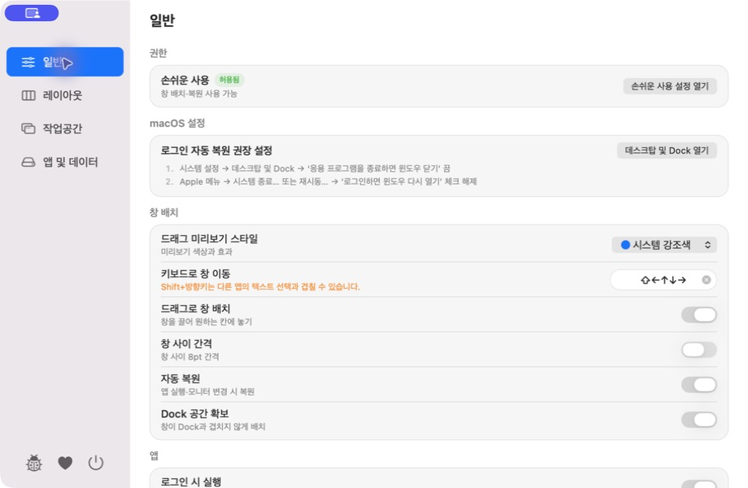
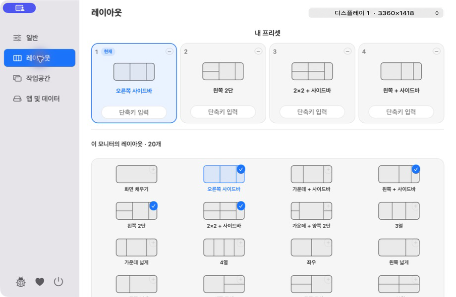
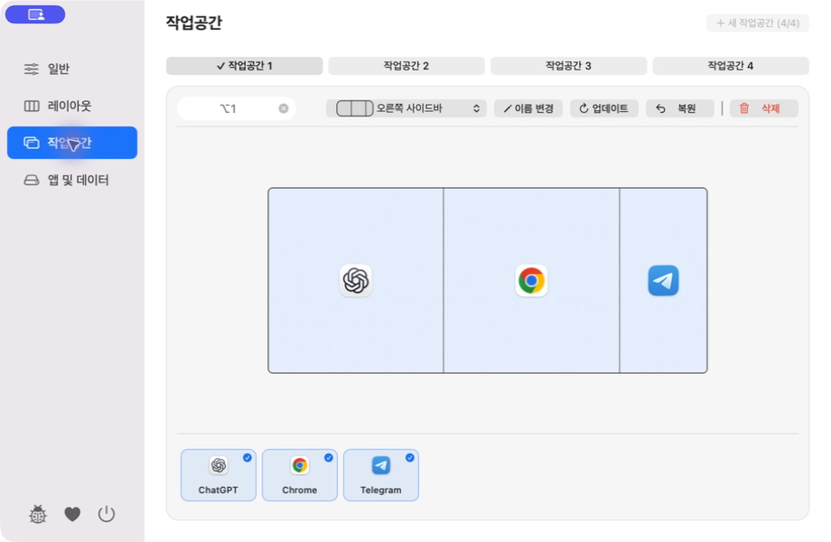
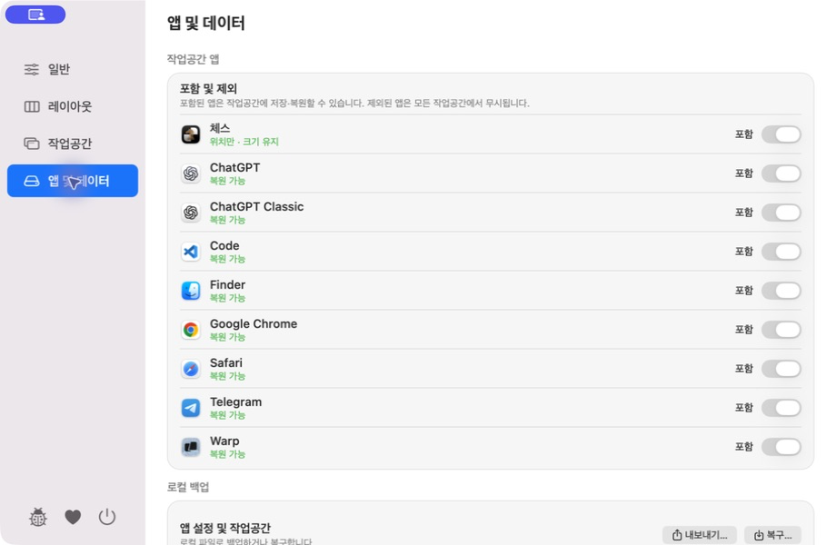

<a id="english"></a>

# TWMA

**T**his is a **W**indow **M**anagement **A**pp.

[한국어](#korean)

TWMA is a macOS menu bar app for arranging windows, saving them as workspaces, and restoring them later. This repository is the official download and support channel for the TWMA public beta.

## Download

Current public beta: [TWMA 0.3.0 Beta 8 (Build 10)](https://github.com/4celain/twma-releases/releases/tag/v0.3.0-beta.8)

- [Download `TWMA-0.3.0-beta.8-build.10-arm64.dmg`](https://github.com/4celain/twma-releases/releases/download/v0.3.0-beta.8/TWMA-0.3.0-beta.8-build.10-arm64.dmg)
- [View all releases](https://github.com/4celain/twma-releases/releases)

Requirements:

- Apple Silicon Mac
- macOS 14 or later

The DMG is signed with Developer ID, notarized by Apple, and verified with Gatekeeper. To verify a download, run the following command and compare the result with the SHA-256 value in the release notes:

```zsh
shasum -a 256 TWMA-0.3.0-beta.8-build.10-arm64.dmg
```

## Install and update

1. Open the downloaded DMG.
2. Drag `TWMA.app` to the Applications folder.
3. Launch TWMA and follow the prompt to allow Accessibility access.

TWMA is distributed directly rather than through the Mac App Store. Beta 7 must be upgraded to Beta 8 manually once. Beta 8 can then check for later versions automatically or on demand and installs an update only after user approval.

<a id="in-action"></a>

## In action · 주요 기능

### Drag to snap · 창 드래그 배치



### Restore a workspace · 작업공간 복원



### Settings · 설정

| General · 일반 | Layouts · 레이아웃 |
| --- | --- |
|  |  |
| Workspaces · 작업공간 | Apps & Data · 앱 및 데이터 |
|  |  |

## Main features

| Area | Included |
| --- | --- |
| Window layouts | Compatible choices vary by display resolution and aspect ratio · drag to snap · optional 8 pt gap |
| Keyboard | Move the focused window with a modifier + arrow key |
| Workspaces | Save, update, and restore · choose a restore layout · reorder or exclude apps |
| Window recovery | Launch a saved app · recover a uniquely matched minimized or windowless app |
| Automation | Workspace shortcuts · optional restore after launch, wake, or display changes |
| Data | Local JSON backup and restore |
| Updates | Automatic or manual checks · install only after approval |

## Public beta notes

| Current scope | Behavior |
| --- | --- |
| Workspaces | Up to four per matching display setup and orientation |
| Windows | One representative window per app |
| Spaces | Ordinary windows on the active desktop only |
| Excluded windows | Full-screen, floating, and system-dialog windows |
| App control | No force quit, restart, or recreation of closed documents and browser tabs |

Restoration still depends on the Accessibility information exposed by each app.

## Privacy and support

TWMA stores workspace data and diagnostics locally. It has no account system, analytics, advertising, tracking, or automatic cloud sync. Public builds contact the static GitHub update feed when checking for a new version; no window or workspace data is included. See the [Privacy Notice](PRIVACY_EN.md) for details.

- [Report a bug](https://github.com/4celain/twma-releases/issues/new?template=bug_report.yml)
- [Report a security issue privately](https://github.com/4celain/twma-releases/security/advisories/new)
- [Read the Security Policy](SECURITY.md#english)
- [☕ Ko-fi](https://ko-fi.com/4celain)
- [🧡 CTEE](https://ctee.kr/place/4celain)

---

<a id="korean"></a>

## 한국어

**T**his is a **W**indow **M**anagement **A**pp.

[English](#english)

TWMA는 창을 배치하고, 작업공간으로 저장하고, 나중에 다시 복원하는 macOS 메뉴 막대 앱입니다. 이 저장소는 TWMA 공개 베타의 공식 다운로드·지원 채널입니다.

[주요 기능 동작과 설정 화면 보기](#in-action)

### 다운로드

현재 공개 베타: [TWMA 0.3.0 Beta 8 (Build 10)](https://github.com/4celain/twma-releases/releases/tag/v0.3.0-beta.8)

- [`TWMA-0.3.0-beta.8-build.10-arm64.dmg` 바로 받기](https://github.com/4celain/twma-releases/releases/download/v0.3.0-beta.8/TWMA-0.3.0-beta.8-build.10-arm64.dmg)
- [모든 릴리스 보기](https://github.com/4celain/twma-releases/releases)

지원 환경:

- Apple Silicon Mac
- macOS 14 이상

DMG는 Developer ID 서명, Apple 공증과 Gatekeeper 검증을 완료한 파일로 배포합니다. 다운로드한 파일은 다음 명령으로 계산한 값과 릴리스 본문의 SHA-256을 비교해 확인할 수 있습니다.

```zsh
shasum -a 256 TWMA-0.3.0-beta.8-build.10-arm64.dmg
```

### 설치와 업데이트

1. 다운로드한 DMG를 엽니다.
2. `TWMA.app`을 응용 프로그램 폴더로 옮깁니다.
3. TWMA를 실행하고 안내에 따라 손쉬운 사용 권한을 허용합니다.

Beta 7에서 Beta 8은 한 번 수동으로 설치해야 합니다. Beta 8부터는 이후 버전을 자동 또는 수동으로 확인할 수 있으며, 사용자가 승인할 때만 업데이트를 설치합니다.

### 주요 기능

| 영역 | 지원 내용 |
| --- | --- |
| 창 배치 | 모니터 해상도·화면비에 따라 표시 항목과 개수가 달라지는 프리셋 · 드래그 배치 · 선택적 8pt 간격 |
| 키보드 | 보조키 + 방향키로 현재 창 이동 |
| 작업공간 | 저장·업데이트·복원 · 복원 레이아웃 선택 · 앱 순서 및 제외 설정 |
| 창 복구 | 저장된 앱 실행 · 유일하게 일치하는 최소화·창 없는 앱 복구 |
| 자동화 | 작업공간 단축키 · 실행·잠자기 해제·모니터 변경 후 선택적 복원 |
| 데이터 | 로컬 JSON 백업·복구 |
| 업데이트 | 자동·수동 확인 · 사용자 승인 후 설치 |

### 공개 베타 참고 사항

| 현재 범위 | 내용 |
| --- | --- |
| 작업공간 | 같은 모니터 구성과 방향마다 최대 4개 |
| 창 수 | 앱마다 대표 창 1개 |
| Space | 현재 데스크탑의 일반 창만 지원 |
| 제외 창 | 전체 화면·플로팅·시스템 대화상자 |
| 앱 제어 | 강제 종료·재시작·닫힌 문서와 브라우저 탭 재생성 안 함 |

복원 가능 범위는 각 앱이 제공하는 손쉬운 사용 정보에 따라 달라질 수 있습니다.

### 개인정보와 지원

TWMA는 작업공간 데이터와 진단 정보를 이 Mac에 저장합니다. 계정·분석·광고·추적·자동 클라우드 동기화가 없습니다. 공개본은 새 버전을 확인할 때 GitHub의 정적 업데이트 피드에 연결하지만 창이나 작업공간 데이터는 보내지 않습니다. 자세한 내용은 [개인정보 처리 안내](PRIVACY.md)에서 확인할 수 있습니다.

- [버그 제보](https://github.com/4celain/twma-releases/issues/new?template=bug_report.yml)
- [보안 문제 비공개 제보](https://github.com/4celain/twma-releases/security/advisories/new)
- [보안 정책](SECURITY.md)
- [☕ Ko-fi](https://ko-fi.com/4celain)
- [🧡 CTEE](https://ctee.kr/place/4celain)

© 2026 4celain. All rights reserved.
